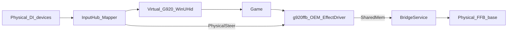

# Architecture

G920 Emulator bridges physical DirectInput devices onto a **virtual Logitech G920** (`VID 046D` / `PID C262`) that games see as a system HID device, and forwards game force-feedback to a physical wheel base.

## End-to-end flow

## Layers

| Layer | Project / binary | Role |
|-------|------------------|------|
| UI | `src/G920Emulator.App` | Profiles, bindings, dependencies, FFB device selection, live meters |
| Bridge | `src/G920Emulator.Core` | Poll loop (~500 Hz), mapping, OEM shared-memory I/O, FFB apply |
| Virtual HID | `src/G920Emulator.VirtualHid` | WinUHid device, G920 report descriptor, OEM registry / COM registration |
| OEM FFB driver | `native/g920ffb/g920ffb.dll` | `IDirectInputEffectDriver` loaded by DirectInput when games create effects |
| System driver | WinUHid (bundled) | Exposes the virtual HID device to Windows / games |
| Input isolation | HidHide | Hides physical pads/wheels from games so only the virtual G920 is seen |

## Input path (physical → game)

1. **InputHub** enumerates DirectInput joysticks and polls axes/buttons/hats.
2. **MapperEngine** applies the active JSON profile (`Binding` / `SourceRef`) to produce a `MappedG920State`. Profile updates from the UI are picked up on the next loop tick, so rebinding does not require restarting the bridge.
3. **G920ReportBuilder** packs that state into a numbered HID input report matching a real G920 (report ID 1), including H-pattern gear buttons.
4. **VirtualG920Device** submits the report through WinUHid.
5. The game reads the virtual G920 like any other DirectInput / HID wheel.

Gear packing:

- Gears 1–6 = buttons **13–18** (LGS / Driving Force Shifter)
- Reverse = profile `GearReverseOutputButton` (default **19** LGS; **12** for NFS Unbound)

## Force-feedback path (game → physical base)

Games that support a Logitech G920 via DirectInput OEM do **not** rely on Logitech HID++ WriteReports for our virtual device. Instead:

1. On Start, the app registers OEM joystick identity and points `OEMForceFeedback` at **`g920ffb.dll`** (CLSID `{A920FFB0-E7DB-4329-8C13-A966D84A289F}`).
2. The game downloads/starts DI effects (constant, spring, damper, sine, …).
3. `g920ffb.dll` mixes effects and publishes signed torque (−1…+1) plus probe stats into shared memory `Local\G920Emulator.FfbTorque`.
4. **BridgeService** writes physical rim angle into that shared memory (required for spring/damper), reads the mixed torque, and **FfbBridge** applies it as a constant-force effect on the selected physical base.

Details: [force-feedback.md](force-feedback.md).

## Identity and PnP

- Virtual hardware ID uses `HID\VID_046D&PID_C262&REV_9601` so Logitech G HUB’s `logi_joy_hid_filter` does **not** auto-bind (that filter swallows FFB into private IOCTLs).
- DirectInput still maps VID/PID to a G920 OEM profile via registry `OEMData` / `OEMName`.

Research notes: [research-logitech-g920.md](research-logitech-g920.md).

## Profiles

Mapping profiles are JSON under `%AppData%\G920Emulator\profiles`. The UI supports Save / Save As / Delete / Export / Import and a Saved dropdown. Sample profiles may also ship under `profiles/` in the repo.
