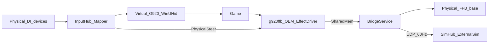

# Architecture

G920 Emulator bridges physical DirectInput devices onto a **virtual Logitech G920** (`VID 046D` / `PID C262`) that games see as a system HID device, and forwards game force-feedback to a physical wheel base.

## End-to-end flow

## Layers

| Layer | Project / binary | Role |
|-------|------------------|------|
| UI | `src/G920Emulator.App` | Profiles, bindings, dependencies, FFB device selection, live meters, FFB Debug Overlay, Telemetry Debug Overlay, Effect Changes Overlay, Telemetry (SimHub UDP), GitHub update zip download |
| Bridge | `src/G920Emulator.Core` | Poll loop (~500 Hz), mapping, OEM shared-memory I/O, FFB apply, optional SimHub telemetry UDP |
| Virtual HID | `src/G920Emulator.VirtualHid` | WinUHid device, G920 report descriptor, OEM registry / COM registration |
| OEM FFB driver | `native/g920ffb/g920ffb.dll` | `IDirectInputEffectDriver` loaded by DirectInput when games create effects |
| System driver | WinUHid (bundled) | Exposes the virtual HID device to Windows / games |
| Input isolation | HidHide | Hides physical pads/wheels from games so only the virtual G920 is seen |

## Input path (physical → game)

1. **InputHub** enumerates DirectInput joysticks and polls axes/buttons/hats.
2. **MapperEngine** applies the active JSON profile (`Binding` / `CustomBinding` / `SourceRef`) to produce a `MappedG920State`. Analog binds use **AxisStart**/**AxisEnd** to remap throw; axis→button uses **Deadzone** as **Activate on Axis** (press at or above that %). Custom bindings can Toggle-latch a G920 button and optionally require an FN hold. Profile updates from the UI are picked up on the next loop tick, so rebinding does not require restarting the bridge. The virtual D-pad can come from a POV hat binding, or from **D-pad Up/Down/Left/Right** button (or axis→button) bindings synthesized into an 8-way hat nibble.
3. **G920ReportBuilder** packs that state into a numbered HID input report matching a real G920 (report ID 1), including H-pattern gear buttons.
4. **VirtualG920Device** submits the report through WinUHid.
5. The game reads the virtual G920 like any other DirectInput / HID wheel.

Gear packing:

- Gears 1-6 = buttons **13-18** (LGS / Driving Force Shifter)
- Reverse = profile `GearReverseOutputButton` (default **19** LGS; **12** for NFS Unbound)

## Force-feedback path (game → physical base)

**Contract:** the game must see and target the **virtual G920 only**. Physical bases, vJoy, and pads are HidHide’d from the game. Which wheel base is attached on the emulator side is an output choice - it must not change what the game sends.

Games that support a Logitech G920 via DirectInput OEM do **not** rely on Logitech HID++ WriteReports for our virtual device. Instead:

1. On Start bridge, a session registers OEM joystick identity and points `OEMForceFeedback` at **`g920ffb.dll`** (CLSID `{A920FFB0-E7DB-4329-8C13-A966D84A289F}`), and pins the Logitech SDK ServerBinary. Stop/Close/crash restore the previous system values.
2. The game (and any helper that opens the same OEM device) downloads/starts DI effects (constant, spring, damper, sine, triangle, …) on that virtual G920.
3. `g920ffb.dll` mixes effects per process and publishes into `Local\G920Emulator.FfbTorque.v7`:
   - **Torque** - game process (primary)
   - **AuxTorque** - Steam/overlay only, layered under the game channel so helpers cannot wipe spring/road forces
4. **BridgeService** writes physical rim angle into that shared memory (required for spring/damper), reads **combined** torque, optionally applies **output feel** / **torque shaping** from the FFB profile, and **FfbBridge** applies it as a constant-force effect on the selected physical base (master gain + invert). Physical DI apply runs on a **side thread** so a slow base cannot stall virtual G920 axis submits.

**Validated FFB bases:** Fanatec Podium Wheel Base DD2 (NFS Heat / Unbound) and Simucube (NFS Unbound). See [compatibility](compatibility.md).

Verbose OEM / HID++ file logging is off until the UI **Debug** session is active; after **Stop debug**, **Export log…** builds the support zip. Leave Debug off for normal play - high-rate games write the OEM log from the game process; use short captures only.

Details: [force-feedback.md](force-feedback.md).

## Identity and PnP

- Virtual hardware ID uses `HID\VID_046D&PID_C262&REV_9601` so Logitech G HUB’s `logi_joy_hid_filter` does **not** auto-bind (that filter swallows FFB into private IOCTLs).
- DirectInput still maps VID/PID to a G920 OEM profile via registry `OEMData` / `OEMName`.

Research notes: [research-logitech-g920.md](research-logitech-g920.md).

## Profiles

- **Input storage:** `%AppData%\G920Emulator\profiles\*.json` and `settings.json`.
- **FFB storage:** `%AppData%\G920Emulator\ffb-profiles\*.json` (seeded **Raw** only). Input profiles link via `ffbProfileName`.
- The publish zip / `dist\G920Emulator\` do **not** include `profiles\` or `ffb-profiles\` (they do ship `README.md` + `CHANGELOG.md`).
- **Starter:** on first run, `ProfileStore` creates AppData, an empty **Default** input profile, and the built-in **Raw** FFB profile only.
- **Migration:** copies **input** `profiles\*.json` and `settings.json` once from (1) next-to-exe leftovers and (2) `%AppData%\N4Sunbound` - never overwrites existing AppData files. Next-to-exe `ffb-profiles\` are **not** migrated; legacy inline FFB fields on input JSON can still become a named FFB profile on load.
- **Identity:** each `SourceRef` stores `deviceId` (instance GUID) and `productId` (product GUID); `DeviceBindingResolver` remaps instance ids when the product is still attached.
- **Portable opt-in:** `portable.txt` beside the exe keeps `profiles\`, `ffb-profiles\`, and `settings.json` next to the app (runtime-created; not shipped).
- UI: input Saved dropdown + Export / Import; FFB profile dropdown + Save / Save As / Delete under Force feedback; **Telemetry** tab for SimHub UDP (External Sim `.simdef` in `simhub/`).
