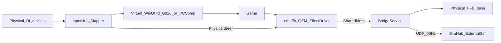

# Architecture

Steering Wheel Emulator bridges physical DirectInput devices onto a **virtual wheel** that games see as a system HID device — **Logitech G920** (`VID 046D` / `PID C262`) or **Fanatec DD1** (`VID 0EB7` / `PID 0004`) — and forwards game force-feedback to a physical wheel base.

## End-to-end flow

## Layers

| Layer | Project / binary | Role |
|-------|------------------|------|
| UI | `src/SteeringWheelEmulator.App` | Emulated-device combo, profiles, bindings, dependencies, FFB device selection, live meters, overlays, Telemetry (SimHub UDP), GitHub update zip download |
| Bridge | `src/SteeringWheelEmulator.Core` | Poll loop (~500 Hz), mapping, OEM shared-memory I/O, FFB apply, optional SimHub telemetry UDP |
| Virtual HID | `src/SteeringWheelEmulator.VirtualHid` | WinUHid device (G920 or Fanatec PC Comp), report descriptors, OEM registry / COM registration |
| OEM FFB driver | `native/emuffb/emuffb.dll` | Shared `IDirectInputEffectDriver` for G920 and Fanatec PC Comp identities |
| System driver | WinUHid (bundled) | Exposes the virtual HID device to Windows / games |
| Input isolation | HidHide | Hides physical pads/wheels from games so only the virtual wheel is seen |

## Input path (physical → game)

1. **InputHub** enumerates DirectInput joysticks and polls axes/buttons/hats.
2. **MapperEngine** applies the active JSON profile (`Binding` / `CustomBinding` / `SourceRef`) to produce a `MappedG920State`. Analog binds use **AxisStart**/**AxisEnd** to remap throw; axis→button uses **Deadzone** as **Activate on Axis** (press at or above that %). Custom bindings can Toggle-latch a G920 button and optionally require an FN hold. Profile updates from the UI are picked up on the next loop tick, so rebinding does not require restarting the bridge. The virtual D-pad can come from a POV hat binding, or from **D-pad Up/Down/Left/Right** button (or axis→button) bindings synthesized into an 8-way hat nibble. Optional **SimHub telemetry** (synth + UDP) runs on a **side thread** so it cannot stall HID submits; when telemetry is off the input loop skips that path entirely.
3. The active **emulated-device profile** packs that state into a HID input report (G920 report builder or Fanatec DD1 builder).
4. **VirtualG920Device** or **VirtualFanatecDd1Device** submits the report through WinUHid.
5. The game reads the virtual wheel like any other DirectInput / HID device.

Gear packing (G920 identity):

- Gears 1-6 = buttons **13-18** (LGS / Driving Force Shifter)
- Reverse = profile `GearReverseOutputButton` (default **19** LGS; **12** for NFS Unbound / Fanatec PC Comp default)

## Force-feedback path (game → physical base)

**Contract:** the game must see and target the **virtual wheel only** (G920 or Fanatec PC Comp). Physical bases, vJoy, and pads are HidHide’d from the game. Which wheel base is attached on the emulator side is an **output** choice only.

**Important:** many titles (especially **Forza Horizon**) author **different FFB mixes per device class**. With the **G920** identity you get G920-authored signals (often sparse Constant Force), not a Fanatec-native spring-led mix — even when playing back on a Fanatec or Simucube base. Choosing **Fanatec DD1** presents `0EB7:0004` so titles that prefer that class can author a different mix. See [force-feedback.md — How games author FFB](force-feedback.md#how-games-author-ffb-forza-vs-nfs-g920-vs-dd).

Games drive FFB through DirectInput OEM into our EffectDriver (not Logitech HID++ WriteReports on the virtual device):

1. On Start bridge, a session registers OEM joystick identity and points `OEMForceFeedback` at **`emuffb.dll`** (CLSID `{A920FFB0-E7DB-4329-8C13-A966D84A289F}`). **G920** also pins the Logitech SDK ServerBinary; **Fanatec PC Comp** skips the Logitech SDK (Fanatec OEM tree + `emuffb` only — no Fanatec SDK / FAW). Stop/Close/crash restore the previous system values.
2. The game downloads/starts DI effects on that virtual identity.
3. `emuffb.dll` mixes effects per process and publishes into `Local\G920Emulator.FfbTorque.v7`:
   - **Torque** - game process (primary)
   - **AuxTorque** - Steam/overlay only, layered under the game channel so helpers cannot wipe spring/road forces
4. **BridgeService** writes physical rim angle into that shared memory (required for spring/damper), reads **combined** torque, optionally applies **output feel** / **torque shaping** from the FFB profile, and **FfbBridge** applies it as a constant-force effect on the selected physical base (master gain + invert). Physical DI apply runs on a **side thread** so a slow base cannot stall virtual axis submits. PC Comp + Fanatec physical FFB forces dual-handle Exclusive FFB.

**Validated FFB bases:** Fanatec Podium Wheel Base DD2 (NFS Heat / Unbound) and Simucube (NFS Unbound; Forza Horizon on G920 OEM path). See [compatibility](compatibility.md).

Verbose OEM / HID++ file logging is off until the UI **Debug** session is active; after **Stop debug**, **Export log…** builds the support zip. Leave Debug off for normal play - high-rate games write the OEM log from the game process; use short captures only.

Details: [force-feedback.md](force-feedback.md).

## Identity and PnP

- **G920:** Hardware ID `HID\VID_046D&PID_C262&REV_9601` so Logitech G HUB’s `logi_joy_hid_filter` does **not** auto-bind. DirectInput maps VID/PID via registry `OEMData` / `OEMName`.
- **Fanatec DD1:** WinUHid node `VID_0EB7&PID_0004` with `REV_E001`; Fanatec OEM registration pins `emuffb` on that identity. No Fanatec SDK. Physical Fanatec is never filtered out of Detected devices by VID alone (needed for bind/FFB).

Research notes: [research-logitech-g920.md](research-logitech-g920.md) (includes PC Comp summary).

## Profiles

- **Input storage:** `%AppData%\SteeringWheelEmulator\profiles\*.json` and `settings.json`.
- **FFB storage:** `%AppData%\SteeringWheelEmulator\ffb-profiles\*.json` (seeded **Raw** only). Input profiles link via `ffbProfileName`.
- **Emulated device** is stored on each input profile (`emulatedDevice`) and in settings; last profile name is remembered per identity.
- **Session (HidHide):** optional `session.hidHideSnapshot` captured on **Save**; restored when switching profiles or on Start if Settings HidHide mode is Off.
- The publish zip / `dist\SteeringWheelEmulator\` do **not** include `profiles\` or `ffb-profiles\` (they do ship `README.md` + `CHANGELOG.md`).
- **Starter:** on first run, `ProfileStore` creates AppData, an empty **Default** input profile, and the built-in **Raw** FFB profile only.
- **Migration:** copies **input** `profiles\*.json` and `settings.json` once from (1) next-to-exe leftovers and (2) `%AppData%\N4Sunbound` - never overwrites existing AppData files. Next-to-exe `ffb-profiles\` are **not** migrated; legacy inline FFB fields on input JSON can still become a named FFB profile on load. Legacy JSON `fanatecDd1Xbox` / `fanatecDd1Pc` map to PC Comp or G920 as appropriate.
- **Identity:** each `SourceRef` stores `deviceId` (instance GUID) and `productId` (product GUID); `DeviceBindingResolver` remaps instance ids when the product is still attached.
- **Portable opt-in:** `portable.txt` beside the exe keeps `profiles\`, `ffb-profiles\`, and `settings.json` next to the app (runtime-created; not shipped).
- UI: emulated-device combo + input Saved dropdown + Export / Import; FFB profile dropdown + Save / Save As / Delete under Force feedback; **Telemetry** tab for SimHub UDP (External Sim `.simdef` in `simhub/`).
